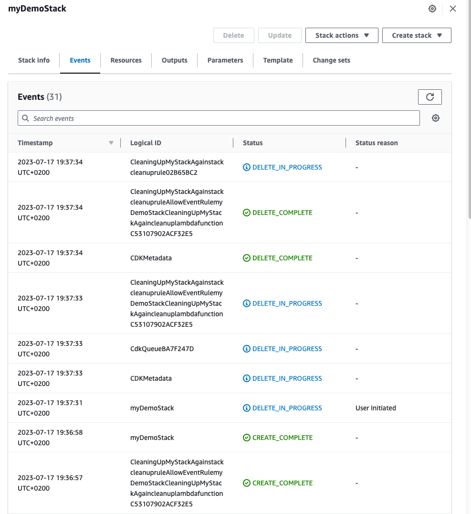

# CDK AWS Cleaner Example

This project showcases the usage of the AWS CDK Auto-Deletion Construct to automate the cleanup of AWS CloudFormation stacks.

## Prerequisites

- AWS CDK installed
- Node.js and npm or yarn installed

## Installation

1. Clone this repository.

2. In your terminal, navigate to the `cdk` directory:
   ```
   cd cdk
   ```

3. Install the required dependencies using npm or yarn:
   ```
   npm install
   ```
   or
   ```
   yarn install
   ```

## Deployment

To deploy the example stack:

1. Make sure you are still in the `cdk` directory.

2. Deploy the stack using the AWS CDK command:
   ```
   cdk deploy
   ```

3. Follow the prompts to confirm the deployment.

4. Wait for the deployment to complete. Once finished, the stack will be up and running.



## Cleanup

To remove the example stack and perform cleanup:

1. In the `cdk` directory, run the following command:
   ```
   cdk destroy
   ```

2. Confirm the stack removal by following the prompts.

3. Wait for the cleanup process to complete. Once finished, the stack and associated resources will be removed from your AWS account.

## Contact

For any questions, help, or support related to this project, please contact us at aws@zerodotfive.com. We are a German company based in Hamburg, specializing in AWS services and solutions.

## License

This project is licensed under the [MIT License](LICENSE).